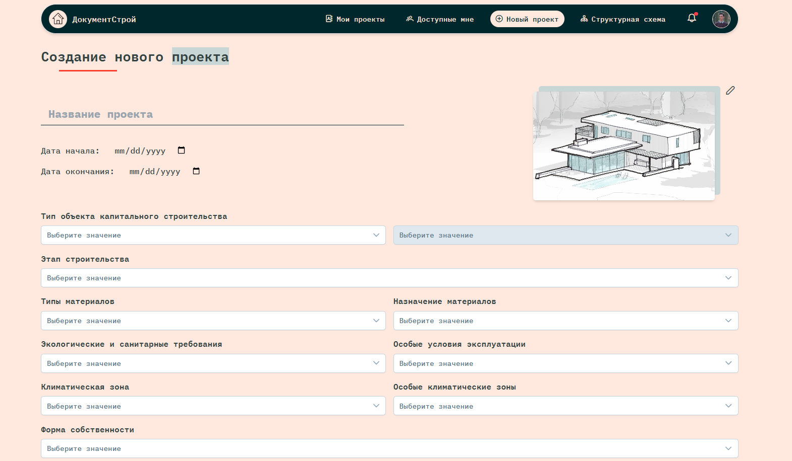

<!-- --------LOGO-------- -->
 

	
	
<strong>ДокументСтрой</strong> - WEB-приложение для автоматизации правовой поддержки при проектировании объекта строительства

<!-- --------ABOUT THE PROJECT-------- -->

## О проекте

	
	
	
	

 

<strong>ДокументСтрой</strong> - использует следующие технологии:

<ul>
	<li>MongoDB</li>
	<li>Express.js (MVC)</li>
	<li>TypeScript</li>
	<li>Vue.js</li>
	<li>PrimeVue</li>
	<li>Pinia</li>
	<li>Vee Validate + Yup</li>
	<li>FSD</li>
	<li>TanStack Query</li>
	<li>Firebase Auth</li>
	<li>TailwindCSS</li>
	<li>Vite</li>
	<li>Docker Compose</li>
	<li>NginX</li>
	<li>Grafana</li>
	<li>Prometheus</li>
	<li>Alloy + Loki</li>
</ul>

#### Немного о продукте

Проблема учета и поиска нормативных документов (ГОСТы, СНИПы, СП, постановления) сотрудниками строительной организации остается весьма актуальной, учитывая регулярные изменения в нормативной базе. Часто возникает необходимость оперативного доступа к актуальной версии документа, поскольку даже небольшое несоответствие может привести к нарушениям и штрафам. На каждый раздел проектной документации требуется учитывать и применять большое количество нормативных документов, что существенно усложняет процесс ручного учета и поиска. Руководители строительных организаций нередко сталкиваются с проблемой поиска удобного и доступного сервиса, который обеспечивал бы централизованное хранение документов, автоматический контроль их актуальности и быстрый поиск.

Приложение будет актуально и полезно следующему кругу лиц строительной организации:

-   Проектировщикам на этапе подготовки проектной документации, обеспечивая доступ к актуальным нормативным документам.
-   Инженерам и руководителям проектов на этапе строительства для оперативного поиска и сверки нормативов.
-   Юристам строительных компаний, которым необходимо учитывать изменения в нормативных документах и обеспечивать их соответствие законодательству.

<!-- --------CONTRIBUTING-------- -->

## Контрибуция

Контрибуция делает сообщество с открытым исходным кодом удивительным местом для обучения, вдохновения и творчества. Любой ваш вклад **высоко ценится.**

Если у вас есть предложение по улучшению, пожалуйста, сделайте fork репозитория и создайте pull request. Вы также можете просто создать issue с меткой "enhancement".
Не забудьте поставить star проекту! Спасибо еще раз!

1. Fork репозиторий
2. Создайте вашу Feature Branch (`git checkout -b feature/AmazingFeature`)
3. Сделайте коммиты с изменениями (`git commit -m 'Add some AmazingFeature'`)
4. Push в ветку (`git push origin feature/AmazingFeature`)
5. Откройте Pull Request
